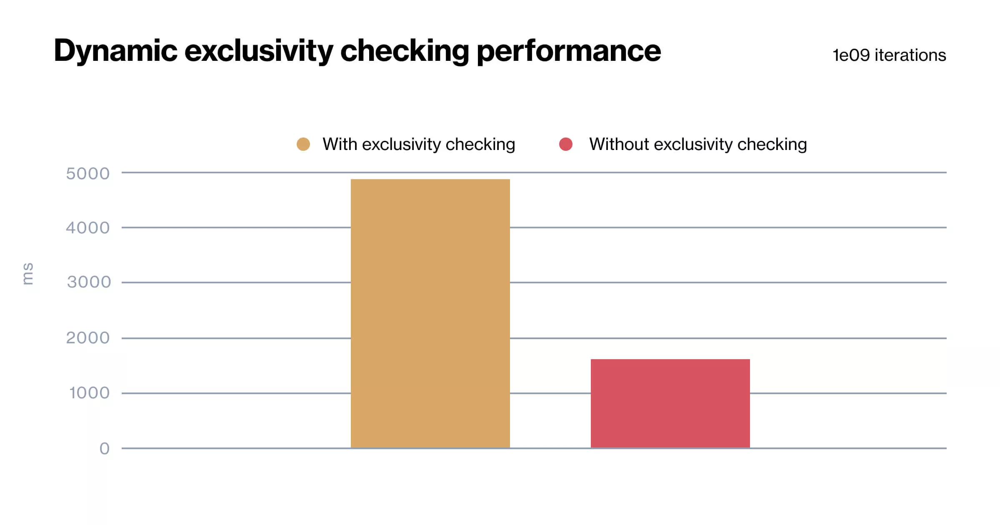
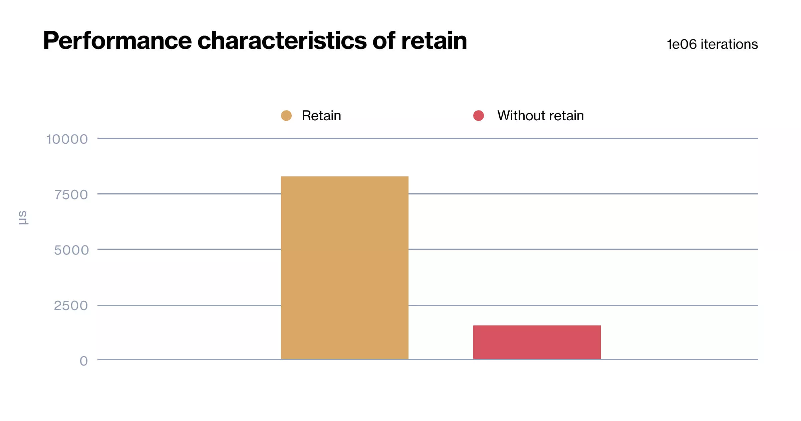
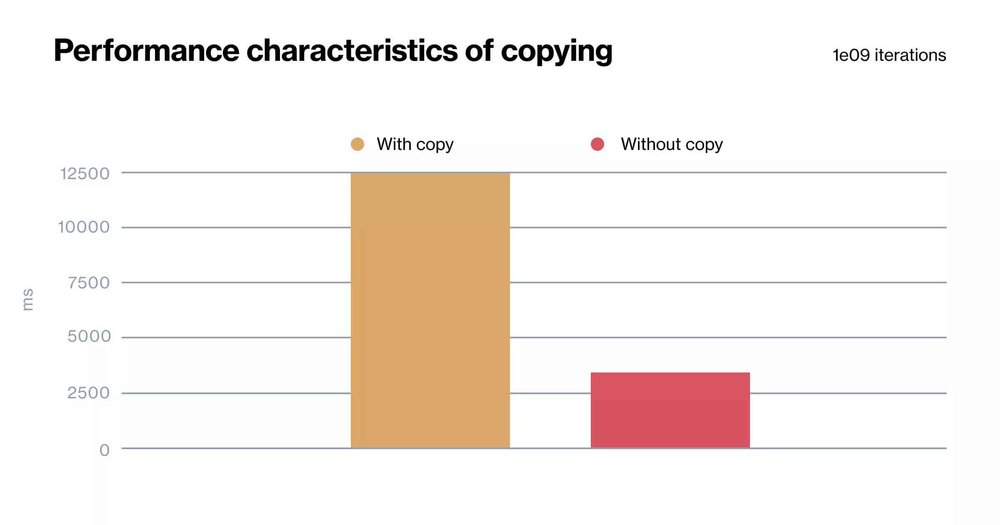
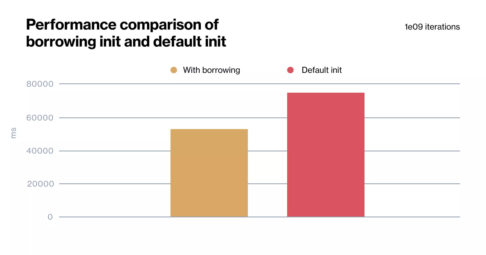
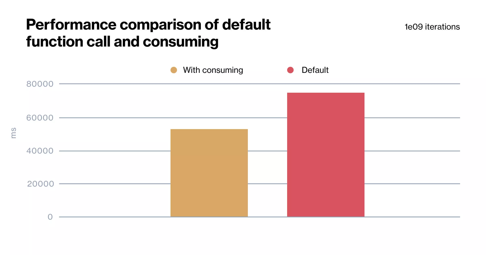
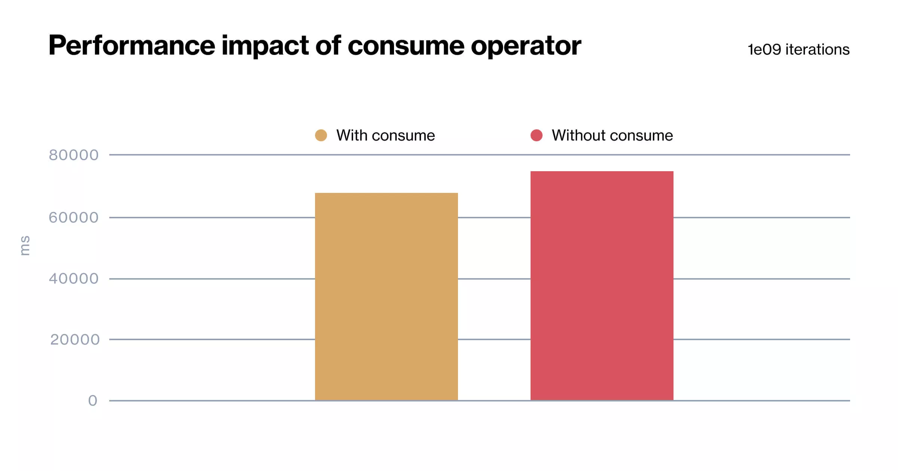

# Swift Ownership

Associated source code for Swift Ownership blog post. Blog post is available [here](https://infinum.com/blog/swift-ownership/).

## Various performance benchmarks from the blog post

- Performance impact of dynamic exclusivity checking:

- Performance impact of `retain`:

- Performance impact of copying big `struct`:

- Impact of using `borrowing` keyword in `init` when ownership is not required

- Impact of using `consuming` keywoard in a function that requires ownership:

- Impact of using `consume` operator when transferring ownership:

